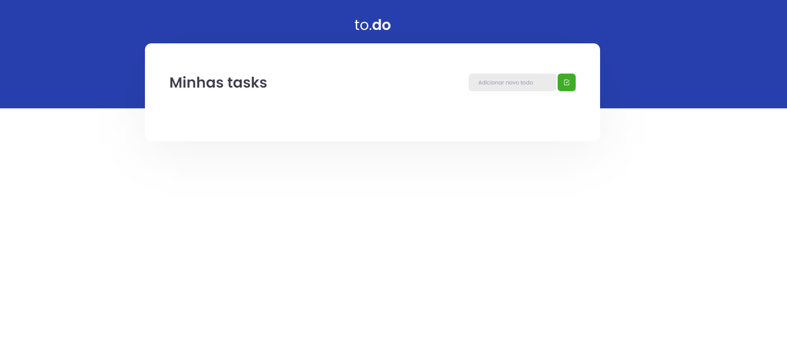
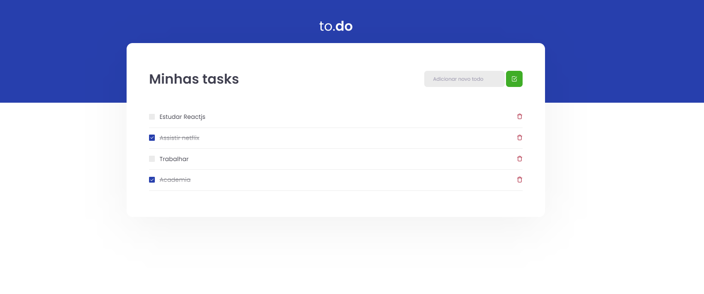

# First Rocketseat challenge ... ReactJs 

<p>
  
  
</p>

## 🧪 Tecnologias

Esse projeto foi desenvolvido com as seguintes tecnologias:

- [React](https://reactjs.org)

## 🚀 Como executar

Clone o projeto e acesse a pasta do mesmo.

```bash
$ git clone https://github.com/Hugovarellaa/ignite-template-reactjs-conceitos-do-react
$ cd ignite-template-reactjs-conceitos-do-react
```

Para iniciá-lo, siga os passos abaixo:
```bash
# Instalar as dependências
$ yarn

# Iniciar o projeto
$ yarn start
```

O app estará disponível no seu browser pelo endereço http://localhost:3000.
#Primeiro desafio Rocketseat... trilha ReactJS

#First Rocketseat challenge ... ReactJS track
